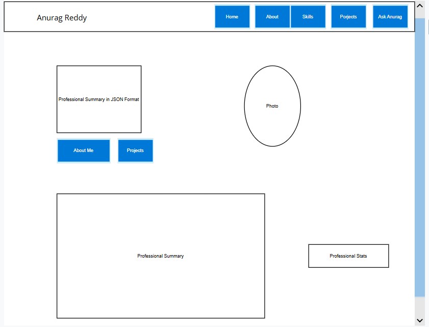
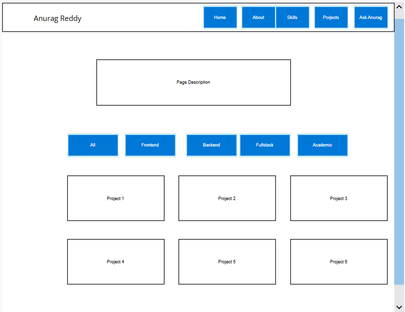
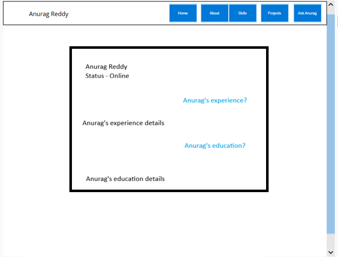

# Portfolio System Design Document

This document outlines the architecture, design choices, user stories, personas, wireframes, and accessibility patterns for Anurag Reddy Pottigari's Personal Portfolio Website.

---

## 1. Description

The Anurag Reddy Pottigari Portfolio is a premium, high-performance, single-author website designed to showcase professional achievements, academic qualifications, and technical projects. 

### Design Philosophy
- **Aesthetic**: Locked in a clean, modern **Light Theme** with elegant transitions and micro-animations.
- **Developer-Centric**: Features a code-editor mockup in the hero section displaying configured details (TS configuration format) with a typed cursor effect.
- **Minimalist Complexity**: Focuses on accessibility, fast load times, semantic HTML structures, and responsive layouts without bloated frameworks.
- **Interactive Capabilities**: Houses a custom client-side AI Chatbot ("Ask Anurag") built to automate inquiries regarding Anurag's career.

---

## 2. User Stories

### Recruiter / Hiring Manager
- **Story**: As a recruiter, I want to quickly view Anurag's summary, technical skills, and past work history so that I can determine if he fits my open positions.
- **Story**: As a recruiter, I want to filter projects by categories (e.g., Frontend, Backend) so that I can see projects relevant only to my active job search.
- **Story**: As a recruiter, I want to view his educational credentials and courses to confirm his academic background at Northeastern University.
- **Story**: As a recruiter, I want to contact Anurag via email, LinkedIn, or GitHub links readily available in the header and footer.

### Developer / Tech Lead
- **Story**: As a tech lead, I want to see the code structure, tech requirements, and project filter options so that I can gauge Anurag's coding quality and versatility (Frontend, Backend, Full-Stack).
- **Story**: As a developer, I want to quickly jump to Anurag's GitHub profile from any page so that I can inspect his open-source code repositories.
- **Story**: As a tech lead, I want to see a developer-oriented portfolio that demonstrates semantic, valid HTML and clean styling choices.

### Casual Visitor
- **Story**: As a visitor, I want to play around with the portfolio playground and chat with the "Ask Anurag" chatbot to learn about him in an interactive, automated format.
- **Story**: As a chatbot user, I want quick suggestion chips (predefined questions) so that I do not have to think of what to type first.
- **Story**: As a mobile user, I want a collapsed responsive navigation drawer so that I can browse pages comfortably on my phone.

---

## 3. User Personas

### Persona 1: Sarah Jenkins, Senior Tech Recruiter
- **Background**: Senior Recruiter at a fast-paced Boston tech startup. Reviews 50+ resumes daily.
- **Goals**: Quickly identify if Anurag has hands-on React/TypeScript and system integration experience.
- **Frustrations**: Hard-to-read portfolios, lack of direct contact links, and sluggish layouts.
- **Need**: Clear and scannable technical skills grid, quick email action buttons, and direct project filters.

### Persona 2: David Chen, Engineering Lead
- **Background**: Technical Lead managing a full-stack platform development team.
- **Goals**: Inspect codebase quality, design consistency, and attention to detail.
- **Frustrations**: Portfolios that look like generic templates or lack semantic markup.
- **Need**: Access to raw GitHub project codes, developer configuration hero display, and robust CSS styling.

### Persona 3: Prof. Linda Ross, CS Academic Advisor
- **Background**: Computer Science faculty advisor at Northeastern University.
- **Goals**: Verify Anurag's student profile, current MSCS coursework, and academic project classifications.
- **Frustrations**: Unclear graduation timelines and missing list of master's coursework.
- **Need**: An explicit education section displaying degrees, institutions, and relevant course badges.

### Persona 4: Alex Patel, Peer Developer
- **Background**: Student collaborator looking for project partners.
- **Goals**: Review Anurag's coding interests, gaming hobbies (Valorant, etc.), and side projects.
- **Frustrations**: Overly corporate, dry portfolio designs that hide human personality.
- **Need**: An inviting personal interests section and interactive playground layout.

### Persona 5: Marcus Aurelio, Venture Capital Talent Coordinator
- **Background**: Talent Partner matching engineers to portfolio companies.
- **Goals**: Conduct rapid pre-screening regarding Anurag's work authorization, location preference, and specific skill-sets.
- **Frustrations**: Waiting days for email replies to simple qualification queries.
- **Need**: Automated client-side chatbot assistant ("Ask Anurag") with instant answers.

---

## 4. Design Choices

- **Color Palette**: Locked into a dedicated, high-contrast **Light Theme** consisting of:
  - Background Neutral: Light Slate Blue (`#f8fafc`) and White (`#ffffff`) for page layers.
  - Text Primary: Dark Slate (`#0f172a`) to ensure maximum readability.
  - Accent Primary: Elegant Indigo (`#6366f1` / Hover `#4f46e5`) to represent professional development.
- **Typography**:
  - `Inter`: used as the main body typeface.
- **Layout Grid**: 12-column responsive Bootstrap 5 grid allowing clean transitions from wide desktop viewports to stacked mobile viewports.
- **Animations**: Soft transition fade-ins (`translateY(30px)`).

---

## 5. Accessibility (A11y)

- **Semantic HTML**: Strict usage of proper structure tags like `<main>`, `<footer>`, `<nav>`, `<button>`, `<pre>`, `<code>`, and list structures.
- **Contrast Ratios**: Verified color contrasts for dark text (`#0f172a` / `#64748b`) against pure white or light backgrounds to meet WCAG AA and AAA readability guidelines.
- **Screen Reader Support**: Added a visually hidden `<h1>` element at the top of the main container on `index.html` to define page level heading without altering the visual mock editor design.
- **ARIA Integration**:
  - `aria-label` descriptions for icon-only components (such as chatbot send, email, GitHub, and LinkedIn links).
  - `aria-hidden="true"` applied to layout visual markers (e.g. scroll chevron indicators, window action dots) to filter out noise from screen readers.

---

## 6. Wireframes

Below are structural layout representations for the primary pages of the portfolio.

### Home Page Layout (`index.html`)

### Projects Grid Page Layout (`projects.html`)

### AI Chatbot Layout (`playground.html`)

